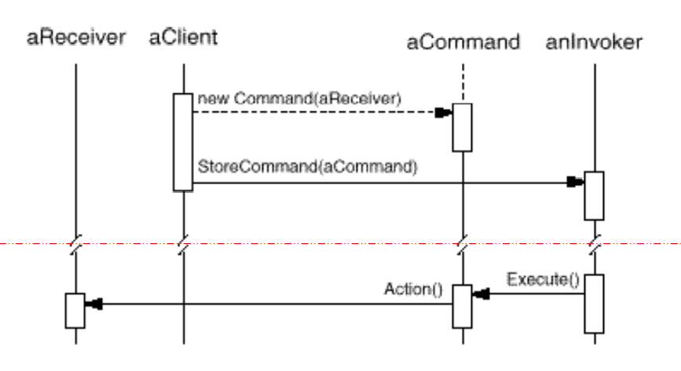
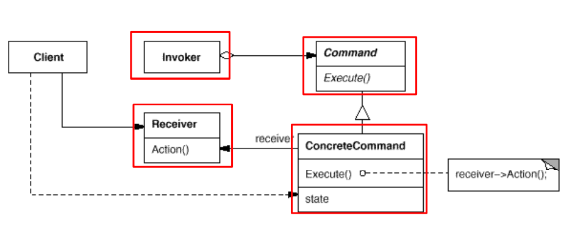

# OOAD Lab1: a Text Editor

Yifan Lu, October 2020

A simple text editor where strings are edited under some commands in the console.

All the commands supported are designed using the **Command Pattern** shown below.

